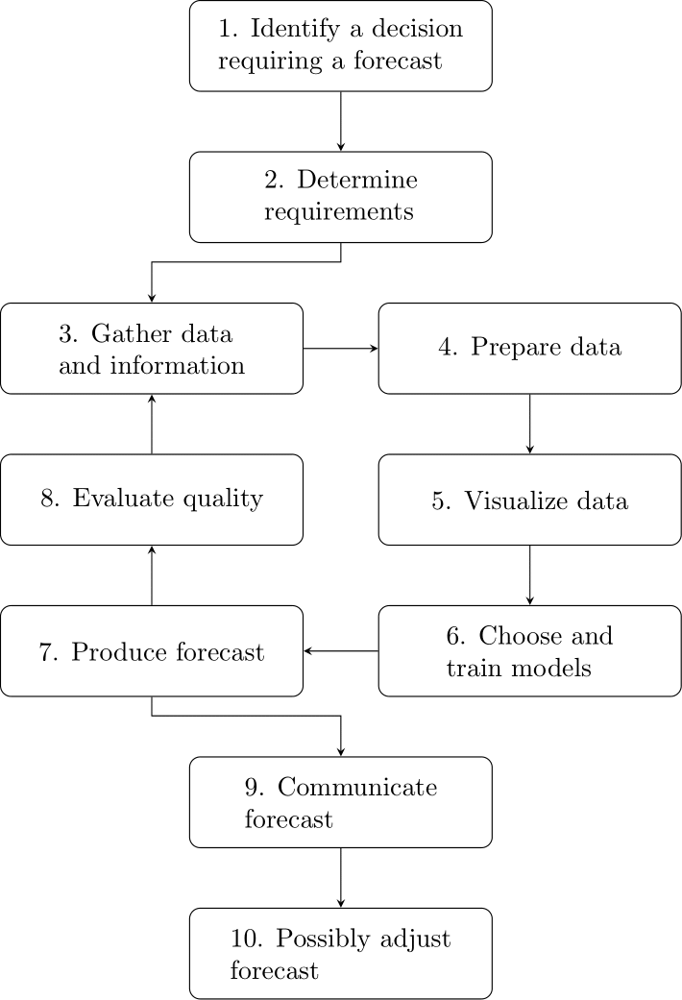

## Outline

\vspace*{0.7cm}\tableofcontents

```{r}
#| label: setup
#| include: false
#| cache: false
source("setup.R")
ausbeer <- as_tsibble(fpp2::ausbeer) |>
  rename(Time = index, Production = value)
library(fpp3)
library(tidyverse)
library(mixtime)
```

# Introduction to forecasting

## What is a forecast?

\fontsize{12}{13}\sf
Estimating how a sequence of observations will continue into the future, using all information available now.

```{r forecasting,echo=FALSE, out.width="90%", fig.align='center'}
ausbeer %>% model(ETS(Production)) %>% forecast(h=20) %>% autoplot(tail(ausbeer, 60), level=NULL, alpha=.01)+
  geom_vline(xintercept = as.numeric(as.Date("2010-04-01")),col="red", linetype = "longdash")+
  labs(x ="Time",y="Observation",title = "Forecasting")
```

## What data do we need?

1. Historical data on the variable to forecast
2. Past and future values of predictors
    + Deterministic (e.g. holidays)
    + Stochastic (e.g. temperature)
3. Expert knowledge and context
    + New information

## Why forecast?

Why do you use forecasts?

\pause

\fontsize{12}{13}\sf

| Decision                                              | Forecast  |
| ----------------------------------------------------- |:---------:|
| Build a new hospital in the next 10 years?            |      ?    |
| Call centre staff needed next week?                   |      ?    |
| Vaccine doses needed next month?                      |      ?    |

- Supports planning
- Informs decisions
- Provides evidence

## Forecasting workflow

```{r forecastingworkflow,echo=FALSE, fig.align='center', out.width="32%"}

```


## Packages for this course

\begin{textblock}{4.2}(10.8,0.3)\begin{alertblock}{}\Large\textbf{tidyverts.org}\end{alertblock}\end{textblock}

\placefig{1.8}{1.3}{width=3cm}{tsibble.png}
\placefig{5.2}{1.3}{width=3cm}{mixtime.png}
\placefig{8.6}{1.3}{width=3cm}{tsibbledata.png}
\placefig{3.5}{4.6}{width=3cm}{feasts.png}
\placefig{6.9}{4.6}{width=3cm}{ggtime.png}
\placefig{10.3}{4.6}{width=3cm}{fable.png}

## Packages for this course
\fontsize{11}{12}\sf

```r
# Data, graphics and forecasting
library(fpp3)
```

```{r fpp3-attach, echo=FALSE, message=TRUE, comment=""}
local({
  op <- options(cli.width = 66, cli.unicode = FALSE)
  on.exit(options(op))
  ns <- asNamespace("fpp3")
  attach_msg <- ns$fpp3_attach
  environment(attach_msg) <- list2env(
    list(core_unloaded = function() ns$core), parent = ns
  )
  attach_msg()
})
```

\pause

```r
# Time classes for the index (load after fpp3)
library(mixtime)
```

# Time series data

## Time series data

  - Four-yearly Olympic winning times
  - Annual Google profits
  - Quarterly Australian beer production
  - Monthly rainfall
  - Weekly retail sales
  - Daily IBM stock prices
  - Hourly electricity demand
  - 5-minute freeway traffic counts
  - Time-stamped stock transaction data

## Your time series

\begin{block}{}\Large
What time series do you work with?
\end{block}

\pause

* What is measured?
* How often?
* One series, or many?

## What makes it a time series?

\begin{block}{}
Observations + \alert{when} they happened.
\end{block}

* The time column is the \alert{index}
* Observations are ordered in time
* The frequency matters

# tsibble objects

## A `tsibble` has three parts

\begin{block}{}
A \alert{tsibble} stores one or more time series in a table.
\end{block}

* **Index**: when
* **Key**: which series (optional)
* **Measures**: what was observed

\vspace*{0.3cm}

Works with tidyverse functions.

## `tsibble` objects

\fontsize{10}{11.2}\sf

```{r, echo = TRUE}
global_economy
```

\only<2->{\begin{textblock}{1.05}(1.5,3.2)
\begin{alertblock}{}\fontsize{10}{10}\sf\mbox{Index}\phantom{dg}\end{alertblock}
\end{textblock}}
\only<3->{\begin{textblock}{1.6}(2.72,3.2)
\begin{alertblock}{}\fontsize{10}{10}\sf Key\phantom{dg}\end{alertblock}
\end{textblock}}
\only<4>{\begin{textblock}{6.3}(5.2,3.2)
\begin{alertblock}{}\fontsize{10}{10}\sf Measures\phantom{dg}\end{alertblock}
\end{textblock}}

## `tsibble` objects

\fontsize{10}{11.2}\sf

```{r, echo = TRUE}
tourism
```

\only<2->{\begin{textblock}{1.3}(1.6,3.13)
\begin{alertblock}{}\fontsize{10}{10}\sf\mbox{Index}\phantom{dg}\end{alertblock}
\end{textblock}}
\only<3->{\begin{textblock}{3.8}(3.05,3.13)
\begin{alertblock}{}\fontsize{10}{10}\sf Keys\phantom{dg}\end{alertblock}
\end{textblock}}
\only<4>{\begin{textblock}{1.8}(7.15,3.13)
\begin{alertblock}{}\fontsize{10}{10}\sf\mbox{Measure}\phantom{dg}\end{alertblock}
\end{textblock}}

\begin{textblock}{3}(9,5)
\begin{block}{}\fontsize{10}{10}\sf Domestic visitor nights (thousands).\phantom{dg}\end{block}
\end{textblock}

## The index needs a time class

```{r tstablemonth, echo=FALSE}
z <- tibble(Month = paste(2019, month.abb[1:5]), Observation = c(50, 23, 34, 30, 25))
```

\fontsize{12}{13}\sf

```{r tstablemonth2}
z
```

\pause

* `"2019 Jan"` is just text
* A time class knows the frequency

## Time classes with `mixtime`

\placefig{12.9}{5.6}{width=2.2cm}{mixtime.png}

\fontsize{12}{13}\sf

Three kinds of time:

| Kind     | Meaning                | Function          | Example    |
| -------- | ---------------------- | ----------------- | ---------- |
| Linear   | Point on a timeline    | `linear_time()`   | 2026 Oct   |
| Cyclical | Position in a cycle    | `cyclical_time()` | Mon        |
| Duration | Length of time         | `duration()`      | 3 months   |

\pause

\vspace*{0.3cm}

The time index for a tsibble is typically \alert{linear time}.

## Linear time

\fontsize{12}{13}\sf

Common frequencies have convenient functions:

```{r tstable2, echo=FALSE}
tribble(
  ~`Frequency`, ~Function,
  "Annual", "`year()`",
  "Quarterly", "`yearquarter()`",
  "Monthly", "`yearmonth()`",
  "Weekly", "`yearweek()`",
  "Daily", "`date()`",
  "Seconds", "`datetime()`"
) |>
  knitr::kable(booktabs = TRUE)
```

## Linear time

\fontsize{11}{12}\sf

Often data is provided in a date format, even if it isn't daily.

```{r linear-helpers, collapse=TRUE}
d <- as.Date("2026-10-01")
yearquarter(d)
yearmonth(d) + 0:2
```

\pause

Multiple granularities can share one vector:

```{r linear-mixed, collapse=TRUE}
c(yearquarter(d), yearmonth(d), date(d))
```

## Making a `tsibble`

\fontsize{12}{13}\sf

```{r month-tsibble}
z |>
  mutate(Month = yearmonth(Month)) |>
  as_tsibble(index = Month)
```

## Custom granularity

```{r mt-narrow, include=FALSE}
options(width = 60)
```

\fontsize{11}{12}\sf

Any time step with `linear_time()`:

```{r chronon-minute, collapse=TRUE}
x <- datetime("2024-01-01 00:00:00") + minutes(0:5) * 15L
linear_time(x, chronon = cal_gregorian$minute(15L))
```

\pause

* `chronon`: the size of one time step
* `cal_gregorian$minute(15L)`: 15 minutes
* `cal_gregorian$hour(6L)`: 6 hours

## Timezones

\fontsize{11}{12}\sf

```{r timezones, collapse=TRUE}
t <- as.POSIXct("2026-10-05 22:30:00", tz = "UTC")
datetime(t, tz = "Africa/Lagos")
datetime(t, tz = "Africa/Nairobi")
date(t, tz = "Africa/Nairobi")
```

\pause

* Same moment, different local time zone.
* The date can change!

## Cyclical time

\fontsize{11}{12}\sf

\alert{Cyclical time} describes positions within a cycle:

```{r cyclical, collapse=TRUE}
month_of_year(d)
day_of_week(d)
time_of_day(t)
```

\pause

* Also `week_of_year()`, `day_of_month()`, `day_of_year()`
* Useful for seasonal patterns

\pause

\begin{textblock}{4.5}(10,2.2)
\begin{alertblock}{Your turn}
What day of the week were you born on?
\end{alertblock}
\end{textblock}

## Durations

\fontsize{11}{12}\sf

\alert{Durations} describe a length of time:

```{r durations, collapse=TRUE}
months(3)
```

* Also `years()`, `quarters()`, `weeks()`, `days()`, `hours()`, `minutes()`, `seconds()`

\pause

They are useful for arithmetic.

```{r duration-arith, collapse=TRUE}
yearmonth(d) + months(0:2)
yearmonth("2026 Oct") - yearmonth("2025 Jan")
```

\pause

```{r mt-wide, include=FALSE}
options(width = 88)
```

# Example: Australian prison population

## Australian prison population

\full{Beechworth_prison}

## Read a csv file {-}
\fontsize{10}{11}\sf

```{r prison}
prison <- readr::read_csv("data/prison_population.csv")
```
```{r prison2a, dependson="prison", echo=FALSE}
prison
```

## Convert to a time class {-}
\fontsize{10}{11}\sf

```{r prison3}
prison <- readr::read_csv("data/prison_population.csv") |>
  mutate(quarter = yearquarter(date))
```

```{r prison3a, dependson="prison3", echo=FALSE}
prison
```

## Remove the old date column {-}
\fontsize{10}{11}\sf

```{r prison4}
prison <- readr::read_csv("data/prison_population.csv") |>
  mutate(quarter = yearquarter(date)) |>
  select(-date)
```

```{r prison4a, dependson="prison4", echo=FALSE}
prison
```

## Declare the index and keys {-}
\fontsize{10}{11}\sf

```{r prison5}
prison <- readr::read_csv("data/prison_population.csv") |>
  mutate(quarter = yearquarter(date)) |>
  select(-date) |>
  as_tsibble(
    index = quarter,
    key = c(state, gender, legal, indigenous)
  )
```

```{r prison5a, dependson="prison5", echo=FALSE}
prison
```

# Example: Australian pharmaceutical sales

## Australian Pharmaceutical Benefits Scheme

\full{pills}

## Australian Pharmaceutical Benefits Scheme
\begin{block}{}
The \alert{PBS} is the Australian government drug subsidy scheme.
\end{block}
\pause\fontsize{13.3}{15}\sf

  * Subsidises many pharmacy drugs
  * Costs nearly 1\% of GDP
  * Budget relies on forecasts of drug usage
  * Split by drug type (ATC2 x`r length(unique(PBS$ATC2))`), concession (x`r length(unique(PBS$Concession))`) and patient type (x`r length(unique(PBS$Type))`)

## Working with `tsibble` objects {-}
\fontsize{8}{10}\sf

```{r wide, include=FALSE}
options(width = 78)
```

```{r pbs1, dependson='wide'}
PBS
```

## `filter()`: choose rows {-}
\fontsize{8}{10}\sf

```{r pbs2}
PBS |>
  filter(ATC2 == "A10")
```

## `select()`: choose columns {-}
\fontsize{8}{10}\sf

```{r pbs3}
PBS |>
  filter(ATC2 == "A10") |>
  select(Month, Concession, Type, Cost)
```

## `summarise()`: combine over keys {-}
\fontsize{8}{10}\sf

```{r pbs4}
PBS |>
  filter(ATC2 == "A10") |>
  select(Month, Concession, Type, Cost) |>
  summarise(total_cost = sum(Cost))
```

## `mutate()`: create variables {-}
\fontsize{8}{10}\sf

```{r pbs5}
PBS |>
  filter(ATC2 == "A10") |>
  select(Month, Concession, Type, Cost) |>
  summarise(total_cost = sum(Cost)) |>
  mutate(total_cost = total_cost / 1e6)
```

## Save the result {-}
\fontsize{8}{10}\sf

```{r pbs6}
PBS |>
  filter(ATC2 == "A10") |>
  select(Month, Concession, Type, Cost) |>
  summarise(total_cost = sum(Cost)) |>
  mutate(total_cost = total_cost / 1e6) -> a10
```

```{r a10, echo=FALSE, dependson="pbs6"}
a10
```

```{r narrow, include=FALSE}
options(width = 60)
```

## Your turn

\fontsize{12}{13}\sf

### Using `tourism`

1. Find the quarterly total `Trips` for each `State`
2. **Challenge:** Which `State` had the most `Trips` over the whole period?

### Using `PBS`

3. Find the total monthly `Scripts` for ATC2 `"H02"`

\pause

### Hints

* `summarise()` always keeps the index
* `group_by()` the keys you want to keep
* `as_tibble()` drops the index, to summarise over time

## Recap

* A tsibble has an **index**, **keys** and **measures**
* The index needs a time class (`mixtime`)
* Time can be linear, cyclical or a duration
* Use dplyr verbs to wrangle tsibbles
